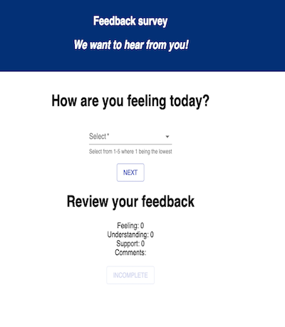

# Feedback Survey

Feedback Survey is an app where a survey given out to students from their insturctors. It gauges how students are feeling about the current material, their understanding, and how they are being supported. Insturctors can use the information to see which students need additional support and how they can improve their teaching.  

### SETUP

Create your database and tables using the provided `data.sql` file. Start the server.

```
npm install
npm run server
```

Now that the server is running, open a new terminal tab with `cmd + t` and start the react client app.

```
npm run client
```

## Features

* Select the answer that best describes you
* Click next to submit your answer and move to the next question
* Your results will update on the bottom on the screen

